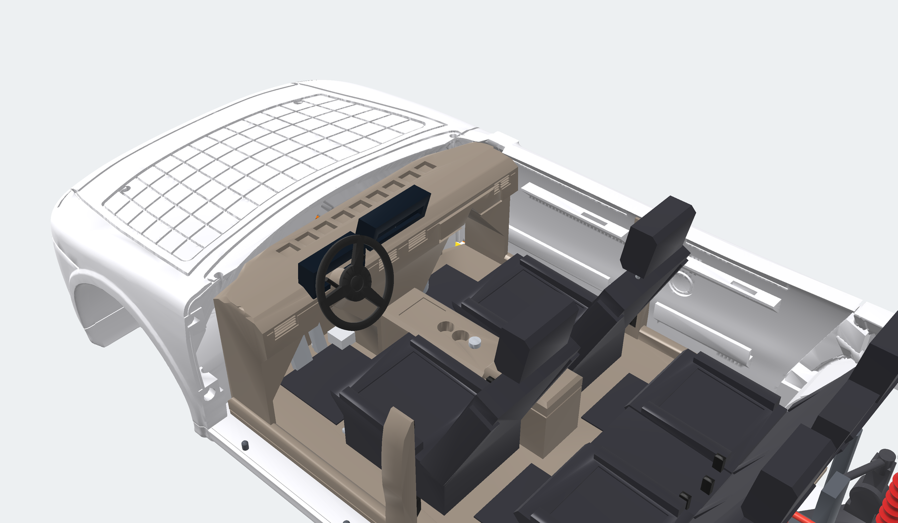
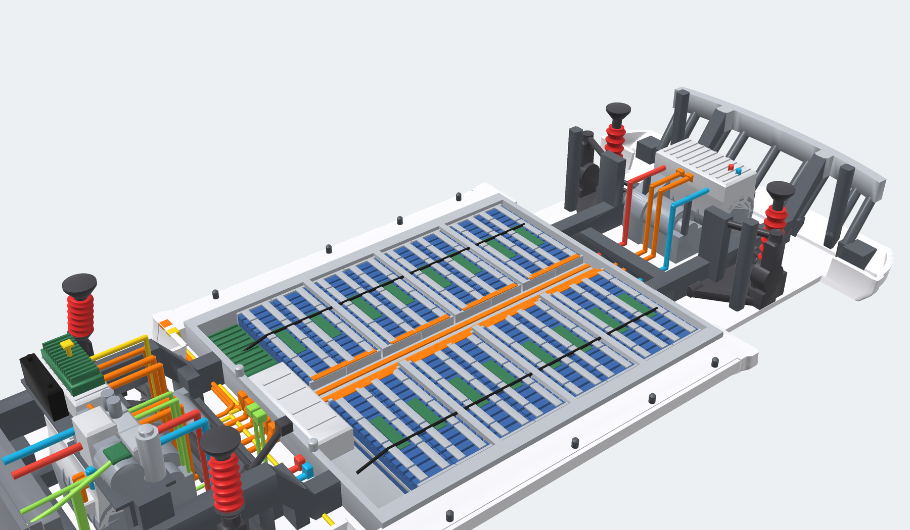
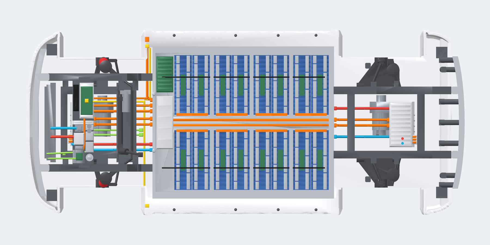
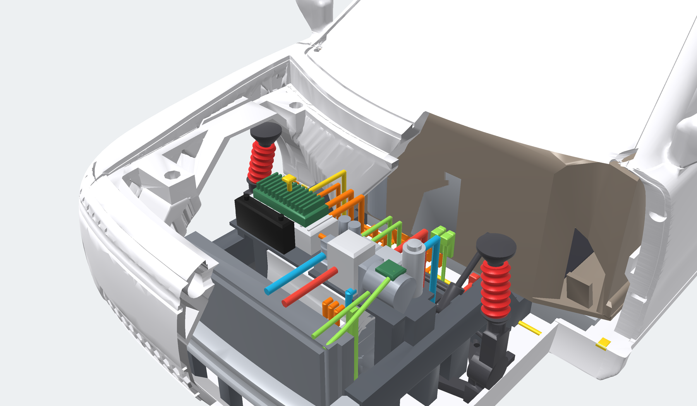
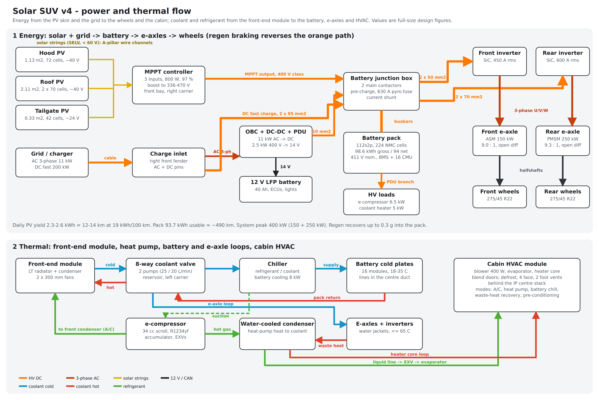
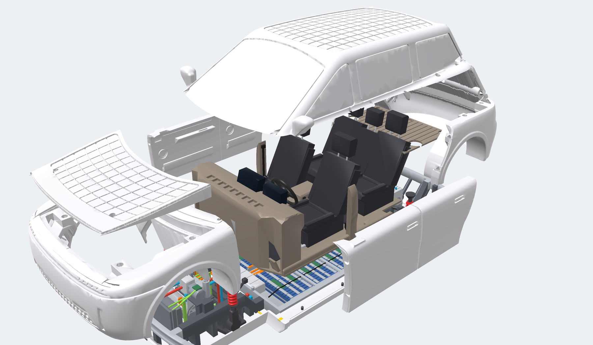

# Solar SUV v4: master engineering and packaging report

**Scope.** This report covers the internal architecture of the v4 solar SUV and its 1:20 modular
cutaway kit:

- the five-seat cabin and cockpit;
- the skateboard chassis and battery;
- the dual e-axles;
- the physical HV harness;
- the thermal system;
- suspension, steering and brakes;
- the kit hardware and the LED channels.

All geometry is generated by `solar_suv_v4_kit.py`, which `solar_suv_v4_1to20.py --part kit` calls.
The design is original and carries no brand names or likenesses.

**Coordinates.** Dimensions are full size in millimetres unless they are marked *model*.

- x points rearward from the front bumper tip.
- y points to the car's right. The car is left-hand drive, so the driver sits at -y.
- z points up from the road.

The kit is exported at 1:20 with the chassis floor (z = 210) on the print bed.

Deliverables:

| # | Deliverable | Where |
|---|---|---|
| 1 | Master engineering and packaging report | this file; numbers also in `stl/kit/packaging.json` |
| 2 | Power and thermal flow diagram | `figs/power_thermal_flow.svg` / `.png`, and the step-by-step flows in section 6 |
| 3 | Parametric CAD code | `solar_suv_v4_kit.py` (cabin, chassis, powertrain, harness, thermal, M2/M3 holes, magnet pockets, LED channels), `solar_suv_v4_1to20.py --part kit` |
| 4 | AI text-to-3D prompt | `ai_prompt_kit.txt` |

Print and assembly instructions are in [KIT.md](KIT.md).

---

## 1. Vehicle package and hard points

The exterior is unchanged from v4:

| Dimension | Value |
|---|---|
| Length | 4,798 mm |
| Body width | 2,027 mm |
| Height | 1,714 mm |
| Wheelbase | 2,950 mm |
| Track | 1,670 mm |
| Tyres | 275/45 R22 |
| Ground clearance | 210 mm |

| Hard point | x | y | z |
|---|---|---|---|
| Front axle / rear axle | 890 / 3,840 | | 403 (wheel centre) |
| Undertray top / battery top / carpet top | | | 234 / 380 / 404 |
| Front H-point (SgRP) | 2,390 | ±390 | 739 |
| Rear outboard H-point | 3,260 | ±370 | 754 |
| Accelerator heel point (AHP) | 1,560 | -390 | 404 |
| Driver eye point (eyellipse centroid) | 2,620 | -390 | 1,399 |
| Steering-wheel centre (rim 370 mm, 23 degrees from vertical) | 1,872 | -390 | 1,104 |
| Kit split planes: chassis / body, body / canopy | | | 352 (door bottom line) / 1,105 (below the 1,118 beltline) |
| Hood underside (flat) | | | 948 |

### Ergonomics

These SAE J1100-style values are measured on the v4 surfaces by `package_metrics()`:

| Metric | Value | Comment |
|---|---|---|
| H30 seat height (H-point above heel) | 335 mm | SUV posture, easy entry |
| L53 H-point to heel | 830 mm | |
| L34 front effective leg room | 1,166 mm | |
| H61 front effective head room | 1,008 mm | |
| H63 rear effective head room | 982 mm | |
| L50 front-to-rear couple distance | 870 mm | |
| Front shoulder room | 1,525 mm | |
| Hip room, front / rear | 1,630 / 1,323 mm | rear is limited by the wheel houses |
| Step-in height (sill top) | 468 mm | flat floor, no tunnel: the battery sits under the floor |
| Door openings: front, at the sill / rear, at the belt | 1,078 / 985 mm | |
| Down-vision angle over the hood | 9.5 degrees | |
| Up-vision angle to the header | 29.1 degrees | |
| Approach / departure / breakover | 25.8 / 30.3 / 16.2 degrees | |

**Ingress and egress.** Entry is easy for three reasons:

- The 335 mm seat height and the 468 mm sill put the hip close to standing height.
- The B-pillar trim with the belt retractor sits at x 2,470-2,575, behind the front seat back
  (backrest x 2,460), so it does not intrude on the front door aperture.
- The rear doors open 985 mm at the belt.

**Sight lines.** The cockpit stays clear of the driver's view:

- The cluster pod tops out at z 1,198. That is 201 mm below the eye and 12 degrees below the
  horizontal at its 0.9 m viewing distance.
- The IP is trimmed to stay 75 mm under the windscreen inner surface, and both display pods sit
  below the windscreen.
- The steering-wheel rim leaves the cluster visible through its upper half.

---

## 2. Step 1: cabin and cockpit (kit part 02, removable cabin floor)

| Item | Position and size |
|---|---|
| Cabin floor plate | x 1,340-3,640, flat carpet at z 404 (24 mm on the battery top); notched at x 1,340-1,460 around the A-pillar gussets |
| Front bucket seats (2) | Seat track x 1,940-2,530 on 2 rails per seat (y ±195 from the seat centre). Cushion front 1,925 at z 690, rear 2,460 at z 640. Backrest 25 degrees, 600 mm high with side wings. Headrest top z 1,490 on 2 posts. Buckle stalk inboard |
| Rear bench, 60/40 (3 places) | Outboard places at y ±370, cushion x 2,930-3,425, backrest 27 degrees, 560 mm. Centre place 300 mm wide with its own headrest |
| Centre console | x 1,560-2,700, 250 mm wide, top z 680. Pass-through bay under it (x 1,830-2,110) with a 50-degree gable roof. Wireless-charging pad (x 1,800-1,945), 2 cup holders (diameter 80 at x 2,020 / 2,110), selector knob (x 2,195), armrest x 2,350-2,700 |
| Instrument panel (IP) | x 1,340-1,768, top z 1,094. Two tent-roofed footwells (y 150-790). Defroster grille with 9 slots (x 1,430-1,510). 4 face vents (y ±95, ±700). Glovebox shut line at y 240-690, z 905-1,010. Trim inlay band at z 1,015-1,030 |
| Steering column and wheel | Column shroud from the IP to the hub along the 23-degree axis. Indicator and wiper stalks (y ±45 from the column, rising 51 degrees). Wheel: 370 mm rim, 3 spokes, separate part on a 2 mm peg |
| Driver cluster | Light-box pod x 1,665-1,762, y -540 to -240 (300 mm wide), z 1,046-1,198, leaning 7 degrees |
| Central touchscreen | Light-box pod x 1,625-1,730, y ±175 (350 x 150 mm, about 15 inch), z 1,072-1,222, leaning 17 degrees |
| Pedals (floor-hinged organ type) | Accelerator y -330 to -270, brake y -480 to -380, dead pedal y -760 to -660. Pivots at x 1,440-1,475 on the floor |
| HVAC module | Case x 1,340-1,560, y ±149, z 400-820 (evaporator, PTC/heater core, blend doors). Blower scroll diameter 250 at (1,450, 310). Fresh-air box x 1,340-1,540, y 200-440, z 640-730. Foot ducts at y ±150-240. Refrigerant ports on the front face at y -130 / -80 |
| Seat-belt anchors | B-pillar trims (x 2,470-2,575). Retractor block z 470-600, webbing up the pillar, D-ring at z 1,010-1,055. Buckle stalks on the seat inner sides |
| Door cards (on the doors) | Armrest (48-degree underside) front x 1,795-2,400 / rear x 2,690-3,180, with a pull cup. Map pocket from z 480 with a bottle bay. Speaker grille diameter 140 at z 760. Handle recess at z 965-1,005. Trim inlay at z 1,025-1,075 |
| Storage | Glovebox, console bay and pass-through, cup holders, door map pockets, cargo deck over the rear e-axle (z 740-764, x 3,650-4,560) |

---

## 3. Step 2: skateboard chassis, battery and e-axles (kit part 01)

### 3.1 Frame, crumple zones and mounts

| Element | Geometry |
|---|---|
| Undertray | 24 mm plate at z 210-234 over the full plan (the bed face of the kit). Rockers are solid between x 1,340 and 3,390 |
| Front bumper beam | Aluminium, 62 mm deep, follows the nose plan bow (x ~150-280), z 440-560, \|y\| ≤ 780, open C-section |
| Front crush cans | x 212-332, \|y\| 440-520, z 440-560 |
| Front rails | x 330-1,152, \|y\| 440-520, z 430-580. They kick down (52 degrees) onto the battery front wall at x 1,302-1,420. Body-mount towers at x 470, 700, 830-950 (carries the axle bore), 1,060 and 1,210 |
| Front subframe (cradle) | x 450-1,250 on \|y\| 300-380, cross-members at x 450-520 and 1,040-1,250 (rack crossmember, notched for the harness and pipes), z 234-320 |
| Rear rails | \|y\| 300-380, z 320-380 from the battery to x 4,382, then kick up to (4,582, 560-682) |
| Rear subframe | x 3,480-4,390 on \|y\| 300-380, cross-members at 3,480-3,560 and 4,220-4,300 |
| Rear crush cans and beam | Cans x 4,580-4,662, z 560-682; beam follows the tail bow, z 560-680, with 5 struts to the rails |
| Side impact | 208 mm between the rocker skin (\|y\| 1,013) and the battery side frame (\|y\| 805). The battery frame is a 70 mm extrusion with 2 grooves |

**Crumple zones.**

- Front: the beam front is at x 150. The first hard point (the front e-axle motor) is at x 555,
  which leaves 400 mm of crush. The battery front wall is 1,270 mm from the beam.
- Rear: the battery ends at x 3,340. The rear beam is 1,320 mm further back, with the rear
  e-axle in between.

### 3.2 Battery pack (112s2p, 98.6 kWh gross)

| Item | Value |
|---|---|
| Envelope | x 1,420-3,340 (1,920), \|y\| ≤ 805 (1,610), z 210-380 (170 including the undertray) |
| Cells | 224 prismatic NMC cells, 173 x 45 x 115 mm, 120 Ah, 3.67 V nominal, 2.0 kg |
| Modules | 16 modules of 14 cells (7s2p), each 654 x 185 x 128 mm, in 8 rows x 2 sides (\|y\| 70-724). Row x positions: 1,652, 1,842, 2,071, 2,261, 2,490, 2,680, 2,909, 3,099 |
| Electrical | 112s2p: 411 V nominal (336-470 V), 240 Ah, 98.6 kWh gross / 93.7 kWh usable |
| Mass | 448 kg of cells, about 590 kg pack (cell-to-pack factor 1.32) |
| Structure | 70 mm side extrusions, 32 mm end walls, 12 mm cold plate (z 234-246) under all modules. 3 cross-members, 36 mm wide (x 2,031, 2,450 and 2,869), which double as seat-rail mounts |
| Centre duct | \|y\| < 60, from the junction box to the rear wall. Coolant supply and return inside, 2 orange busbars on top (z 330-338) |
| Battery junction box (BJB) | x 1,462-1,640, y ±280: 2 main contactors, pre-charge, 630 A pyro fuse, current shunt |
| BMS master unit | x 1,462-1,640, y 320-700 (finned lid). A daisy chain at y ±480 runs over the 16 cell-monitoring boards (green, on each module) |
| Busbars | 7s2p links on each module, module-to-module links at the module ends (orange) |
| External ports | Front wall: DC to the front inverter (y -20 / +40), charging stack (y 120 / 180), DC fast charge (y 240), coolant in/out (y -290 / -230). Rear wall: DC to the rear inverter (y ±30), rear coolant loop (y ±150) |

Range at 19 kWh/100 km: 93.7 kWh usable gives **about 490 km**. Solar adds 12-14 km a day (v4 yield figures).

### 3.3 Dual e-axles

| | Front e-axle | Rear e-axle |
|---|---|---|
| Motor | 150 kW induction (ASM), axis (670, z 450), diameter 230 x 350 mm (y -250 to 100) | 250 kW PMSM, axis (4,065, z 455), diameter 250 x 360 mm (y -260 to 100) |
| Reduction | 2-stage parallel-axis, 9.0:1, open differential at the axle (x 890, diff housing radius 118) | 2-stage, 9.3:1, open differential at x 3,840 (radius 122) |
| Gearbox | Right side of the motor, y 100-215, hull over motor, idler and diff, with a sump | y 100-220 |
| Inverter | SiC, 450 A rms. On top of the motor: x 575-800, y -250 to 215, z 590-685, cooling fins on top | SiC, 600 A rms. x 3,925-4,170, y -260 to 220, z 600-700 |
| DC input | 2 connectors on the inverter face toward the axle | Same, facing the axle |
| 3-phase | U/V/W busbar loops (3 x about 0.2 m) from the inverter end face to the stator terminal box on the motor shoulder | Same |
| Halfshafts | CV housings at both sides of the diff, axle line z 403 | Same |

The front motor is an induction machine, so the car can coast on the rear PMSM without drag
losses. Peak system power is 400 kW.

---

## 4. Step 3: high-voltage harness (physical routing in the CAD)

The HV harness is colour-coded orange in the chassis part. Every run lies on the undertray, in
the notches of the subframe cross-members, or rises vertically against a housing, so it prints
without support.

Model diameters are oversized for printing:

| Run type | Model diameter | Full size equivalent | Real part |
|---|---|---|---|
| HV cable | 1.3 mm | 26 mm | about 16-19 mm for a shielded 50-70 mm² cable |
| Solar wire channels in the body parts | 2 mm | | |

| # | Run | Conductors (real) | Length | Route (full-size coordinates) |
|---|---|---|---|---|
| 1a | Solar: roof and tailgate strings to the A-pillars | 4 mm² PV cable, SELV < 60 V | 1.80 m per side in the canopy, plus 1.84 m from the tailgate along the roof centre | From the roof junction (2,400, 0, 1,655) along the roof rails, down both A-pillars inside the canopy wire channels, to the A-pillar bases (1,398, ±745) |
| 1b | Solar: A-pillar bases to the rocker-front connectors | 4 mm² | 0.79 m per side in the front clip | Front-clip channels to the harness connectors at (1,364, -880) and (1,364, +810), z 234-352 |
| 1c | Solar: connectors to the MPPT | 4 mm² | 2.21 m (left), 0.60 + 1.13 m (right) | Across the undertray in front of the battery, then up the right riser to the MPPT (788, 222, 830) |
| 1d | Solar: hood string | 4 mm² | 0.1 m | Hood pigtail (725, 230) drops straight into the MPPT below the hood |
| 2a | MPPT and OBC output (charging stack) to the BJB | 2 x 10 mm² | 2 x 1.13 m | Battery front-wall ports (y 120, 180), forward on the undertray, up against the front gearbox, into the stack at x 800, z 750 |
| 2b | DC fast charge: inlet to the BJB | 2 x 95 mm² | 0.62 m | Inlet (right front fender) through the front-clip channel to the rocker connector (1,364, 880), across to the battery DC-fast-charge port (y 240) |
| 2c | AC charge: inlet to the OBC | 5 x 4 mm² (3-phase) | 1.67 m | Same connector, then the right riser to the OBC |
| 3a | BJB to the front inverter | 2 x 50 mm² | 2 x 0.99 m | Front-wall ports (y -20 / +40), forward on the undertray under the rack, up the diff housing (x 1,021), into the inverter DC connector at x 824, z 635 |
| 3b | BJB to the rear inverter | 2 x 70 mm² | Busbars 1.7 m + cable 2 x 0.96 m | Centre-duct busbars to the rear wall (y ±30), then cables back on the undertray, up at x 3,705, into the inverter at x 3,901, z 645 |
| 4 | Inverters to the stators | 3 x 50 mm² (front), 3 x 70 mm² (rear) | 3 x about 0.2 m each | U/V/W busbar loops from the inverter end face down to the stator terminal box |
| 5 | Power distribution unit (PDU) to the e-compressor | 2 x 6 mm² | 0.36 m | Across the front carriers from the charging stack to the compressor |

**Current ratings.** At 411 V:

- The front e-axle's 150 kW peak draws 365 A DC, so 50 mm² is used (10 s peak rating).
- The rear e-axle's 250 kW peak draws 610 A DC, so 70 mm² is used.
- DC fast charging at 200 kW draws 490 A, so 2 x 95 mm² is used.

---

## 5. Step 4: thermal system

| Component | Position |
|---|---|
| Front-end module | LT radiator x 300-340, condenser x 278-300, both \|y\| ≤ 400, z 234-760. Shroud x 340-398 with 2 fans (diameter 300) at y ±205, z 560 |
| Heat-pump thermal module (left carrier, z 685-700 on the front inverter, posts to the rails and subframe) | e-compressor (34 cc scroll, R1234yf, 6.5 kW) at (640, -430 to -290, 795), diameter 124. Accumulator diameter 80 at (755, -370). Chiller x 712-800, y -320 to -205. Water-cooled condenser x 712-800, y -195 to -95. Reservoir x 588-700, y -240 to -110. 8-way valve at (650, -62). 2 pumps (25 / 20 L/min) at (752, -90 / -40) |
| Charging stack (right carrier) | PCU (11 kW OBC + 2.5 kW DC-DC + PDU) x 650-800, y 40-420, z 700-800. MPPT (3 inputs, 800 W) x 662-788, y 80-380, finned to z 880. 12 V LFP battery (40 Ah) x 582-642, y 120-400 |
| Cabin HVAC | See section 2 |

| Loop | Pipe (model diameter 1.4 mm, about 28 mm OD full size) | Length |
|---|---|---|
| Radiator to reservoir (hot) / radiator to 8-way valve (cold) | Level runs over the shroud at z 774 | 0.26 / 0.29 m |
| Valve to the front inverter jacket | Drops onto the inverter top | 0.11 m |
| Valve and chiller to the battery cold plates (supply y -290, return y -230) | Down at x 1,000, under the rack crossmember, into the battery front wall | 2 x 1.10 m |
| Battery centre duct to the rear inverter and motor jackets (y ±150) | From the rear wall up at x 3,673, level at z 625 on a bracket, into the inverter | 2 x 0.94 m |
| Compressor to the front condenser (hot gas) | | 0.36 m |
| Condenser to the chiller (liquid) | Level at z 769 on a subframe bracket | 0.42 m |
| Liquid and suction lines to the cabin HVAC (y -130 / -80, model diameter 0.9 mm) | Down at x 970, along the undertray, up into the HVAC front face at x 1,300, z 500 | 2 x 1.28 m |

---

## 6. Deliverable 2: power and thermal flow

### Energy, step by step

1. **Sunlight.** Three PV arrays generate SELV-voltage strings (< 60 V):
   - hood: 72 cells, 1.13 m², about 40 V;
   - roof: 2 x 70 cells, 2.11 m², about 40 V each;
   - tailgate: 42 cells, 0.33 m², about 24 V.
2. **Strings to the MPPT.** The strings run through the A-pillar channels (canopy, then front
   clip) and the rocker-front connectors. The hood string drops in directly. The 3-input MPPT
   (800 W, 97 %) boosts them to the 336-470 V battery bus.
3. **MPPT to the battery.** Power goes through the charging stack, the HV cables (run 2a) and
   the BJB into the 112s2p battery. Yield is 2.3-2.6 kWh a day, enough for 12-14 km.
4. **Grid charging.**
   - AC at 11 kW: inlet, then the OBC, then the stack, then the battery.
   - DC fast charging at up to 200 kW: inlet, then 2 x 95 mm² cables directly to the BJB
     contactors, then the battery.
5. **Drive.** The battery feeds the BJB (main contactors, pre-charge, pyro fuse, shunt). From there:
   - Front: 2 x 50 mm² cables to the front SiC inverter, U/V/W to the 150 kW ASM, 9.0:1
     reduction, open diff, halfshafts, front wheels.
   - Rear: centre-duct busbars and 2 x 70 mm² cables to the rear SiC inverter, then the 250 kW
     PMSM, 9.3:1 reduction, rear wheels.
6. **Regeneration.** Braking reverses step 5, up to about 0.3 g, into the battery.
7. **Auxiliaries.**
   - The DC-DC converter (2.5 kW) charges the 12 V LFP battery, which supplies the ECUs and lights.
   - The PDU feeds the e-compressor (6.5 kW) and the coolant heater (5 kW).

### Thermal, step by step

1. **Battery cooling.** Refrigerant runs from the e-compressor to the water-cooled condenser or
   the front condenser, then to the EXV and the chiller. In the chiller it cools the coolant.
   Pump 1 sends that coolant through the 8-way valve to the battery front wall, through the 16
   cold plates (kept at 18-35 °C) and back to the valve.
2. **E-axle cooling.** Pump 2 drives coolant from the valve to the front inverter and motor
   jackets. In parallel, coolant runs through the battery centre duct to the rear inverter and
   motor jackets. The heat goes to the LT radiator, or to the chiller as the heat-pump source.
   E-axle coolant stays at 65 °C or below.
3. **Heat-pump heating.** Compressor hot gas goes to the water-cooled condenser. The heated
   coolant feeds the heater core in the cabin HVAC and can pre-condition the battery. E-axle
   waste heat is recovered through the chiller.
4. **Air conditioning.** The compressor feeds the front condenser. The liquid line takes the
   refrigerant to the cabin EXV and evaporator; the suction line returns it through the
   accumulator to the compressor.
5. **Cabin air.** The blower (400 W) pushes air through the evaporator and the heater core, then
   the blend doors. It leaves through the defrost grille, 4 face vents or 2 foot ducts.

---

## 7. Step 5: suspension, steering and brakes

| Item | Geometry |
|---|---|
| Front: MacPherson strut | Lower A-arm, pivots (800, ±390, 268) and (1,150, ±390, 268), ball joint (870, ±655, 262). Strut from the knuckle clamp (895, ±652, 600) to the top mount (925, ±590, 905): **kingpin inclination 11.5 degrees, castor 5.6 degrees**. Coil spring diameter 104 (6 coils, red) on a 50-degree spring seat. Top mount at z 875-931 |
| Rear: 5-link | Plate-type lower control arm, pivots (3,620 / 4,000, ±390), ball joint (3,820, ±655). Camber link from a tower (3,760, ±432) to the upright (3,845, ±640), level at z 626. Toe link (4,000, ±440) to (3,960, ±655) at z 362. Coilover (3,960, ±560, 284) to (3,966, ±552, 780), spring diameter 108 |
| Knuckles | \|y\| 628-688, inboard of the solid wheel. Hub boss radius 70, steering arm (front) or toe arm (rear) |
| Steering | Electronic rack-and-pinion behind the axle: rack at x 1,080, z 352, housing \|y\| ≤ 400 with boots. Rack-parallel EPS motor diameter 88 at (1,142, 110-330, 366). Pinion and intermediate shaft from (1,080, -300, 352) to the column at (1,295, -340, 610). Tie rods level at z 354 to the steering arms at (1,030, ±655) |
| Sway bars | Front: bar on the rack crossmember (x 1,205, z 334), ends on the lower arms (1,048, ±495). Rear: bar on the rear cross-member (x 4,262), along the subframe side members, ends on the lower-arm plates (3,992, ±545) |
| Brakes (on the v4 wheel part) | 400 x 34 mm vented, slotted rotor (friction ring 140-200 mm radius, 10 curved slots, hat groove). 6-piston monobloc caliper straddling the rotor rim (centre radius 192 mm), visible through a spoke window |

---

## 8. Step 6: kit engineering

| Feature | Detail |
|---|---|
| Part split | **Chassis** below z 352 (door bottom line). **Front clip** ahead of the front door seam, **rear clip** behind the rear door seam (both include the wheel-house awnings). **4 doors**, each a 4.5 mm *model* slab with a door card. **Hood** above its flat underside (z 948). **Roof canopy** above z 1,105. **Cabin floor** on the battery top. **Cargo deck** |
| Screw bosses | M3 x 10 at the rocker ends (1,395 / 3,330, ±915) and M2 x 10 at the bumper corners (360, ±770 / 4,480, ±740). Clearance holes and counterbores enter from the chassis bed face. Pilots (8 mm *model* deep) sit in 5.8 mm square bosses on the clip bed faces. Cabin floor: 2 x M2 x 8 at (2,887, ±770) into the battery side frames, with a raised boss so the head pocket fits |
| Magnet pockets (3.2 x 2.1 mm *model*, 44 magnets) | Door edges: front clip / front door / B-line / rear door / rear clip at z 560 and 960, 24 magnets. Hood: (420, ±560) and (1,150, ±640) on a ledge, 8. Canopy over the C-pillars at (3,900, ±835), 4. Cargo deck posts (3,700, ±600) and (4,500, ±560), 8. Horizontal pockets have teardrop roofs |
| Pins | 8 door pins (diameter 1.5 x 2.0 mm, chamfered) on the rocker tops. 8 canopy pins on the door tops. 2 cabin-floor pegs (diameter 2.0) on the battery front wall. Steering-wheel peg diameter 2.0 |
| Removal levels | Canopy, then doors, then hood, then clips (4 screws each), then cabin floor (2 screws) and cargo deck. This exposes the battery tray, motors and wiring. See KIT.md |
| Printability | Hollow shells (1.6 mm skin) are filled with a voxel support structure (3 x 7.5 mm full-size voxels, 0.15 x 0.375 mm on the model, 50-51 degree ramps). It is clipped 1.2 mm inside the skin so engravings stay crisp, and kept 0.8 mm off every chassis or cabin part that rises into the shell. The canopy is solid with tent-roofed cavities over the cabin. Horizontal tubes are teardrops, and every pipe or cable run is either level (a bridge of 12 mm or less), vertical, or lying on a surface |

---

## 9. Step 7: LED channels

| Light | Channel (model mm) | Feeds |
|---|---|---|
| Headlights (front clip) | 4.0 mm teardrop tunnel behind the lamp band at z 905, \|y\| ≤ 840 full size, inside a 1.6 mm wall tube | 6 x diameter 1.0 windows per side (matrix modules, y 470-760). Gabled light-blade slits at z 941-947. 3 mm exit rearward on the centre line |
| Tail bar (rear clip, liftgate) | 4.0 mm tunnel at z 1,192, \|y\| ≤ 640 | Light slits along the bar (z 1,188-1,196) opening into the channel. 3 mm exit forward |
| Rear corner lamps (canopy) | 4.0 mm tunnels, \|y\| 690-780, z 1,160 | 1.0 mm windows. 3 mm drop to a 3 mm socket in the rear clip |
| Driver cluster and centre display (cabin floor) | Light boxes about 3-3.5 mm deep behind see-through windows, walls 1 mm | 4 mm channel down and forward to the IP front face at z 950 |
| Undertray exits (chassis) | 3 x 4 mm at (1,300, ±420) and (3,420, 0) | Wire exits under the model |

Every light slit has a 50-degree roof that starts at the skin, so its ceiling never bridges along
the slit. The headlight blade slits are blind, with a gable roof. The tail-bar slits open into the
channel: their roof rises straight to the channel's centre line and meets the channel's upward tip
there, so no knife edge is left hanging between slit and channel.

---

## 10. Verification

All exports pass `tools/check_stl.py`:

- watertight;
- every edge shared by exactly two faces;
- a flat bed face;
- one shell per part. `wheels_x4` has 4 shells and `axles_x2` has 2, by design.

`tools/print_check.py` slices each part like a slicer, at 0.2 mm layers and 0.1 mm pixels. It
classifies every pixel that is more than one layer (45 degrees) away from the layer below as one of:

- a **bridge**: anchored on two opposite sides;
- a **cantilever**: anchored on one side;
- an **island**: not anchored.

`python3 tools/print_check.py --selftest` checks the classifier on known shapes.

| Part | Triangles | Watertight, 1 shell | Size (model mm) | Volume | Bed contact | Max bridge | Long bridges (> 12 mm) | Cantilevers > 0.8 mm (max) | Islands (largest) |
|---|---|---|---|---|---|---|---|---|---|
| kit_01_chassis | 138,374 | yes | 231.7 x 98.2 x 36.5 | 131.9 cm³ | 17,210 mm² | 11.2 mm | 0 | 2 (1.05 mm) | 6 (0.22 mm²) |
| kit_02_cabin_floor | 6,092 | yes | 126.9 x 86.3 x 55.5 | 124.3 cm³ | 9,306 mm² | 8.6 mm | 0 | 2 (2.05 mm) | 0 (0.00 mm²) |
| kit_03_front_clip | 392,566 | yes | 72.6 x 100.1 x 37.5 | 34.9 cm³ | 357 mm² | 3.0 mm | 2 | 15 (2.15 mm) | 52 (0.24 mm²) |
| kit_04_rear_clip | 394,356 | yes | 76.4 x 101.3 x 65.1 | 28.0 cm³ | 338 mm² | 10.0 mm | 0 | 26 (2.15 mm) | 46 (0.96 mm²) |
| kit_05_door_front_left | 18,892 | yes | 54.9 x 11.9 x 37.5 | 9.5 cm³ | 182 mm² | 2.2 mm | 0 | 3 (1.35 mm) | 0 (0.00 mm²) |
| kit_06_door_front_right | 18,994 | yes | 54.9 x 11.9 x 37.5 | 9.5 cm³ | 182 mm² | 2.2 mm | 0 | 4 (1.35 mm) | 0 (0.00 mm²) |
| kit_07_door_rear_left | 15,164 | yes | 48.9 x 9.8 x 37.5 | 7.4 cm³ | 125 mm² | 3.0 mm | 0 | 3 (1.25 mm) | 0 (0.00 mm²) |
| kit_08_door_rear_right | 15,128 | yes | 48.9 x 9.8 x 37.5 | 7.4 cm³ | 125 mm² | 3.0 mm | 0 | 3 (1.30 mm) | 0 (0.00 mm²) |
| kit_09_hood | 53,282 | yes | 56.1 x 81.8 x 6.9 | 13.8 cm³ | 3,796 mm² | 0.0 mm | 0 | 0 (0.00 mm) | 0 (0.00 mm²) |
| kit_10_roof_canopy | 852,388 | yes | 169.7 x 107.5 x 30.4 | 250.0 cm³ | 12,272 mm² | 0.0 mm | 0 | 4 (1.48 mm) | 1 (0.02 mm²) |
| kit_11_cargo_deck | 1,520 | yes | 45.5 x 64.0 x 1.2 | 3.0 cm³ | 2,754 mm² | 0.0 mm | 0 | 0 (0.00 mm) | 0 (0.00 mm²) |
| kit_12_steering_wheel | 2,080 | yes | 20.2 x 20.2 x 6.2 | 0.3 cm³ | 172 mm² | 0.0 mm | 0 | 0 (0.00 mm) | 0 (0.00 mm²) |

**Accepted residuals.** Each item below is local and small, or is geometry the v4 body already printed with:

| Residual | Where | Size | Why it is accepted |
|---|---|---|---|
| Wheel-house roof bridges | Front clip, both sides | 11.6 mm flat (12.1 mm between supports) | The hood sits directly above, so the roof cannot rise. It uses a 46-degree gable, the v4 rule's minimum. v4 printed the same roofs at 11-12 mm |
| Arch-moulding crowns | Front and rear clips | 2.15 mm cantilever | Unchanged v4 exterior geometry: the 0.7 mm proud moulding at the crown of each arch |
| Bumper-beam pocket roof | Front clip bumper corners | 2.0 mm | Flat roof over the chassis beam end. The beam fills the pocket once assembled |
| Steering-column shroud | Cabin floor | 2.05 mm on 0.2 mm² | A hairline at the shroud's lowest corner, where it meets the IP face |
| Small islands | Clips, chassis | ≤ 0.25 mm² each, except the rear clip: ≤ 0.96 mm² with less than 1 mm reach at the top of the tail-bar channel | Knife-edge tips of teardrop sections and specks smaller than a 0.4 mm extrusion |
| Remaining cantilevers | All parts | ≤ 1.5 mm | Door bottom chamfers, canopy D-pillar and corner-lamp corners, liftgate hinge line, fresh-air box |

**Assembly interference.** The assembled parts overlap 0.19 mm³ (chassis with front clip: 0.05 mm
model contacts at the front rail tops and bumper-beam ends) and 0.01 mm³ (cabin floor with front
clip). Both are within print tolerance. The interference matrix is in
`stl/kit/kit_checks.json` under `_interference_mm3`.

**Engraving depths.** The kit's engraving depths follow the v4 rules:

- 1.1 mm for PV cell gaps, including the battery cell gaps;
- 1.0 mm for panel lines and the glovebox shut line;
- 0.8 mm for lamps, speaker grilles and vent slats;
- 0.3 mm for paint pockets: seat inserts, trim inlays, the charge pad and glass.

---

## 11. Assumptions and simplifications

- **Powertrain and battery specifications** are engineering estimates consistent with the
  geometry, not test data: cell chemistry and capacity, motor ratings, ratios, inverter currents,
  and cable and pipe sizes.
- **Exaggerated wire and pipe diameters.** HV cables, pipes and solar wire channels are
  oversized at 1:20 so they print: HV 26 mm full-size equivalent, coolant 28 mm, refrigerant
  18 mm. Low-voltage harnesses other than the BMS daisy chain are omitted.
- **Printable stand-ins.** Coil springs are corrugated sleeves; fans, grilles and slits are
  engraved; glass is painted (0.3 mm pockets), as on v4.
- **Wheels** are the v4 wheels with the brake disc resized to 400 mm and the caliper moved to
  match. The wheels sit on the 3 mm axles through the knuckles and drive units, as on v4.
- **Cabin.** The cabin floor carries the IP and HVAC as one removable part. In a real car the
  HVAC module and cross-car beam are fixed to the body; here they lift out with the cabin so
  the battery is visible.
