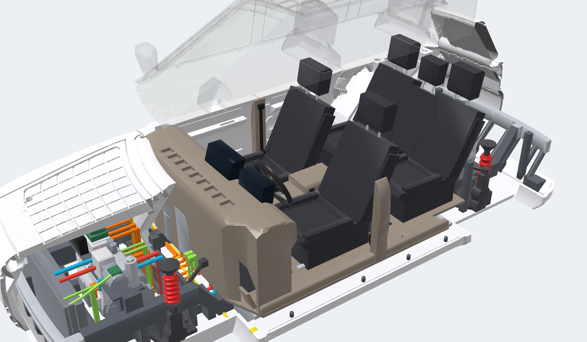

# Solar SUV v4: class-A surfacing, curved body-integrated PV, 1:20 printable

v4 replaces the boxy hull-and-cube geometry of v1–v3 with a curve-driven, filleted surface model. Everything is generated by one Python script. The model is an original design: no brand names, badges or copied styling.

## New: internal architecture and 1:20 modular cutaway kit

`python3 solar_suv_v4_1to20.py --out stl --part kit` turns the v4 exterior into a 12-part kit. You can lift off the roof, doors, hood and body clips, then take out the cabin floor. Underneath are a skateboard chassis with:

- a 224-cell battery (112s2p, 98.6 kWh);
- dual e-axles with inverters;
- MacPherson and multi-link suspension, an electric steering rack and sway bars;
- a front-end cooling module, a heat-pump module and the charging stack with the solar MPPT;
- a physical orange HV harness, coolant and refrigerant lines;
- a five-seat cabin with a full cockpit.

The kit is fixed with M2/M3 screws and 44 3x2 mm magnets, and has 4 mm LED channels in the head, tail and corner lamps and both displays.

| Document | Content |
|---|---|
| [ENGINEERING_REPORT.md](ENGINEERING_REPORT.md) | Packaging and ergonomics, chassis, battery, e-axles, HV harness routing, thermal system, suspension and brakes, kit engineering, LED channels, verification |
| [KIT.md](KIT.md) | Parts, print orientation, hardware, tolerances, assembly and cutaway levels, LED wiring |
| `figs/power_thermal_flow.svg` | Step-by-step power and thermal flow diagram |
| `ai_prompt_kit.txt` | Text-to-3D prompt for the technical cutaway kit |



## Package contents

Delivered as four archives that unpack into the same `solar_suv_v4/` folder:

1. **core**: code, README, one-piece body, wheel, pins, axles.
2. **split**: B-pillar halves.
3. **resin**: hollow resin body.
4. **figures**: renders and the 4-wheel plate.

| File | What it is |
|---|---|
| `solar_suv_v4_1to20.py` | Parametric geometry generator (B-spline curves, blended implicit surfaces, constant-depth engraving, wheels, export) |
| `stl/body_1to20.stl` | One-piece body, 239.9 x 107.5 x 75.2 mm, flat floor, for FDM |
| `stl/body_front_1to20.stl`, `stl/body_rear_1to20.stl` | Body split at the B-pillar for beds under 240 mm, with 3 teardrop pin holes |
| `stl/body_resin_hollow_1to20.stl` | Resin version: 2.5 mm wall, one drained cavity, 285 cm³ instead of 1,176 cm³ |
| `stl/wheel_1to20.stl`, `stl/wheels_x4_1to20.stl` | 275/45 R22 wheel with tread, Y-spoke rim, 400 mm rotor and caliper (single, and 2 x 2 plate) |
| `stl/pins_x3.stl`, `stl/axles_x2_88.25mm.stl` | 3 mm alignment pins and axles. A 3 mm steel or carbon rod cut to 88.25 mm also works |
| `tools/check_stl.py` | Standalone print-readiness check: watertight, edge manifoldness, shells, bed contact, overhang area |
| `solar_suv_v4_kit.py` | Internal architecture and kit generator (called by `--part kit`) |
| `stl/kit/kit_01`...`kit_12_*.stl` | The 12 kit parts, with `kit_checks.json`, `packaging.json` and a colour `kit_assembly_preview.glb` |
| `tools/print_check.py` | Layer-by-layer FDM support check: bridges, cantilevers, islands |
| `tools/render_webgl.py`, `tools/render_kit_figs.py`, `tools/flow_diagram.py` | Offline renderer, kit figures, power and thermal diagram |
| `figs/` | Renders, orthographic views and zebra reflection checks |
| `checks.json` | Full verification output |
| `ai_prompt.txt` | Text-to-3D prompt (784 characters) |

## Design critique of v3 and surface plan for v4

**v3 problems.** Every panel was a hull of straight-sided sections, which created four faults:

- flat facets meeting at 45/90° joints;
- constant-section sides with no tumblehome or haunch;
- arches cut as plain cylinders;
- PV laid out as rectangular grids on flat planes.

The wheels were simple discs with lugs.

**v4 surface plan.**

1. **Curve network** of cubic B-splines:
   - centre-line profiles: front, rear and roof;
   - plan bows of the nose and tail;
   - a lower-body section curve: 46° sill chamfer, tucked rocker, waist, then tumblehome into the shoulder;
   - hood crown and shoulder curves;
   - glass-base and tumblehome curves for the greenhouse.
2. **Surface families** (lower body, hood/deck, greenhouse sides, windscreen/roof, front, rear) are signed fields driven by those curves. They are joined by blended booleans, which act as constant-radius fillet sweeps along every intersection.
3. **Sculpting fields** add:
   - front fender flares;
   - rear shoulder haunches;
   - a rising light-catcher crease along the doors;
   - hood doming between raised fender lines;
   - raised arch mouldings with rolled lips.
4. **Detail is engraved at constant depth below the curved skin** using inset level sets of the same field. Cell gaps, panel lines, glass seals and lamps therefore follow the crown of the hood, roof and tailgate instead of sitting on flat planes.

**Fillet radii (full size → model)**

| Feature | Full size | Model |
|---|---|---|
| Plan corners, front / rear | 220 / 200 mm | 11 / 10 mm |
| Roof rails, A- and D-pillars | 78 mm | 3.9 mm |
| Shoulder line, hood edges | 60 mm | 3.0 mm |
| Windscreen header | 60 mm | 3.0 mm |
| Beltline / cowl (concave) | 42 mm | 2.1 mm |
| Roof spoiler crest | 42 mm | 2.1 mm |
| Mirror root | 34 mm | 1.7 mm |
| Arch-moulding edge / rolled arch lip | 16 mm | 0.8 mm |

Three exceptions to the 2 mm model minimum are deliberate:

- **Arch mouldings.** They stand only 0.7 mm proud, so a radius larger than about 0.8 mm cannot fit on them.
- **Engraved shut lines and seals.** Their edges are crisp, like real panel gaps; rounding a 0.7 mm-wide groove would close it.
- **Floor edge.** It stays sharp for bed adhesion.

## Production detailing

- **Front:** full-width gloss-black lamp mask with a light blade, 6 matrix LED modules per side, bumper split line wrapping to the arches, hexagonal mesh lower intake, corner air curtains, brushed skid plate.
- **Greenhouse:** flush windscreen, side glass and backlight, each with a 1.0 mm seal groove; gloss-black B/C pillars for a floating-roof look; door-mounted aero mirrors.
- **Body sides:** flush pop-out door handles, door cut lines (rear door cut around the arch), sill cladding, charge-port door (right front fender).
- **Rear:** wraparound tail light bar with corner units, liftgate shut lines with a roof hinge line, plate recess, reflectors, finned diffuser.
- **Wheels:**
  - 275/45 R22 tyre with 4 circumferential grooves (45° upper flank), 64 slanted shoulder blocks per side and rib sipes;
  - concave five-Y-spoke rim with bevelled spoke edges and five lug nuts;
  - 400 x 34 mm slotted, vented brake rotor and a sculpted 6-piston caliper straddling it behind the spokes (resized from v4's 494 mm disc to a realistic size for the kit).
- **Depth checks** (measured by ray casting from each recess floor to the unengraved skin):

  | Recess | Measured depth |
  |---|---|
  | PV cell gaps | 1.10 mm |
  | Panel lines / door gaps | 1.00 mm |
  | Glass seals, intake mesh | 1.00 mm |
  | Lamps, tail lights, diffuser fins | 0.78–0.80 mm |
  | Paint-mask pockets (PV laminate, glass, pillars, trim) | 0.30 mm |

## Curved body-integrated PV

| Array | Array area | Cell area as modelled* | Orientation factor |
|---|---|---|---|
| Hood (6 x 12 curvilinear cells) | 1.13 m² | 0.90 m² | 1.00 |
| Roof (14 x 10, tapering with the roof) | 2.11 m² | 1.69 m² | 1.00 |
| Tailgate (3 x 14) | 0.33 m² | 0.23 m² | 0.56 |
| **Total** | **3.57 m²** | **2.81 m²** | |

\*Cell gaps are widened to 12 mm full size (0.6 mm on the model) so they print.

The yield uses the same irradiance, efficiency and performance-ratio assumptions as v2/v3: 5.32 kWh/m²/day x area x orientation factor x 21% x 0.75. For v4 the orientation factor of each surface element is (1 + cos tilt)/2.

| Basis | kWh/day | kWh/year | Range at 19 kWh/100 km |
|---|---|---|---|
| Production estimate (array area at 90% cell packing) | 2.58 | 942 | ≈ 13.6 km/day |
| Cells exactly as modelled | 2.27 | 828 | ≈ 11.9 km/day |

## Package (full size)

| Dimension | Full size |
|---|---|
| Length | 4,798 mm |
| Body width | 2,027 mm (2,151 mm over mirrors) |
| Height on wheels | 1,714 mm |
| Wheelbase | 2,950 mm |
| Track | 1,670 mm |
| Ground clearance | 210 mm |
| Tyres | 275/45 R22 |

## Verification

All parts were checked by `tools/check_stl.py` and by manifold3d.

| Part | Triangles | Watertight, edges 2-manifold | Shells | Bed contact | Area facing down > 45° |
|---|---|---|---|---|---|
| body | 713,682 | yes | 1 | 16,726 mm² | 3,717 mm²: bridges only (see below) |
| body front / rear | 354,816 / 364,988 | yes | 1 / 1 | 9,054 / 7,673 mm² | bridges only |
| body resin hollow | 842,328 | yes | 1 (cavity drained) | 16,710 mm² | internal cavity roof, normal for hollowed resin prints |
| wheel (400 mm rotor) | 126,560 | yes | 1 | 1,096 mm² | 0 |

**Overhangs on the solid body.** The downward-facing area is all bridged:

| Source | Share of area |
|---|---|
| Wheel-arch crowns and wheel-house roofs (45° gable, 11 mm flat bridge) | 43% |
| Axle tunnels (3.3 mm bridges) | 12% |
| Ceilings of horizontal grooves (≤ 1.1 mm deep) | 45% |

The mirror housings sit on a 46° pedestal, so they print without support.

**Assembly.**

- Wheels placed on the axles have 0 mm³ interference with the body; minimum wheel-to-body gap is 0.80 mm.
- Axles sit freely in their slots.
- The press fit engages about 9.3 mm in each hub.

## Printing

**FDM (0.4 mm nozzle)**

- **Body:** upright on its flat floor, no supports. Use 0.12 mm layers, 3 walls, 15% gyroid infill and bridge detection on.
- **Small beds:** print the B-pillar halves and join them with the 3 pins; the holes have 0.15 mm clearance.
- **Wheels:** inner face down, outer face up, 0.08–0.12 mm layers, no supports.
- **Pins and axles:** lying on their 0.4 mm flats.
- **Assembly:** snap each axle up through the 2.75 mm mouth into its slot, then press a wheel onto each end. The bore is 2.9 mm for a 3.0 mm axle.

**Resin**

- **Body:** use `body_resin_hollow_1to20.stl`, which has a 2.5 mm wall and two 3.2 mm drain holes under the floor. Tilt it 30–45° and put supports on the floor and underside only.
- **Wheels:** tilt 20–30°, with supports on the inner face.

**Painting.** The 0.3 mm pockets are paint masks:

| Area | Colour |
|---|---|
| PV laminate | Deep blue |
| Glass | Smoked black |
| B/C pillars and lamp mask | Gloss black |
| Sill cladding and diffuser | Satin black |
| Skid plate | Silver |
| Light blade and LEDs | White |
| Tail lights | Red |

## Regenerating or changing the design

```
pip install numpy scipy scikit-image manifold3d shapely fast-simplification trimesh
python3 solar_suv_v4_1to20.py --out stl                 # all parts, about 2 minutes
python3 solar_suv_v4_1to20.py --res 12 --part body      # 10-second draft
python3 solar_suv_v4_1to20.py --mirrors camera          # slim camera pods instead of mirrors
python3 solar_suv_v4_1to20.py --out stl --part kit      # modular cutaway kit -> stl/kit/ (about 6 minutes)
python3 tools/check_stl.py stl/*.stl stl/kit/*.stl      # check every export
python3 tools/render_kit_figs.py stl/kit/kit_assembly_preview.glb figs   # kit figures (needs playwright)
```

The internal layout is set by the hard-point constants at the top of `solar_suv_v4_kit.py`: H-points, pack rows, drive units, rails, split planes, fastener and magnet positions, and tolerances.

All design curves are at the top of the script: `FRONT`, `REAR`, `_SIDE`, `HOOD_C`, `SHOULDER`, `ROOF`, `GLASS_BASE`. Fillet radii are the `K_*` constants. Groove widths and depths are in model millimetres (`GROOVE_W`, `CELL_D`, `SEAM_W`, `SEAM_D`, `LAMP_D`, `POCKET_D`).

## AI text-to-3D prompt

This prompt is 784 characters. Meshy's limit is 800, and its negative-prompt field no longer has any effect.

```
Sleek premium luxury electric SUV, smooth organic surfacing, curved aerodynamic bodywork, flexible body-integrated solar panels, production-ready automotive design, high detail, 1:20 scale watertight 3D printable STL. Midsize SUV with soft continuous-curvature fillets on every edge, crowned hood and roof, flowing shoulder line and muscular rear haunches. Dark blue solar cell arrays molded into the curved hood, roof and tailgate, following the body lines. Full-width black light band with slim matrix LED headlights, hexagonal lower intake, flush glass, black B and C pillars, flush door handles, wraparound red tail light bar, rounded wheel arches, 22-inch concave Y-spoke alloys with red calipers and detailed tyre tread. Pearl white paint, flat underbody, one solid closed mesh.
```

**Tip.** For a closer match, feed `figs/v4_hero_front34.png` to an image-to-3D mode as the reference. AI-generated meshes usually need repair (hole fill, flat-floor cut) before printing. The STLs in this package do not.
